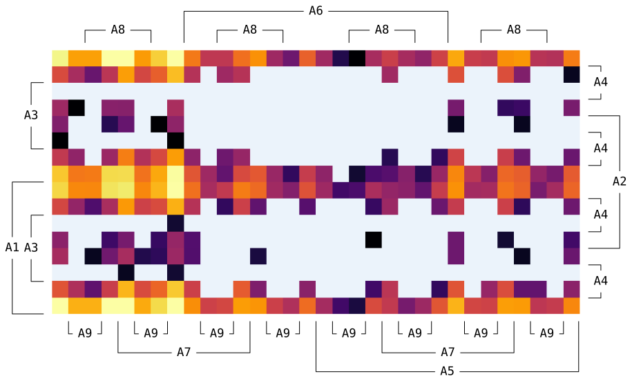

# the Pseudo Karnaugh Map

## Introduction

The Pseudo Karnaugh Map (PKMap),
a coloured Weighted / Multi-valued Karnaugh Map,
an Enchanced Karnaugh Map as the project's initially named,
is an evaluation method to visualize the imbalanced class distribution
of a dataset.

This project was started to guide the generating of synthesis datasets
in which a self-collected data is added into a public dataset.
Later, we found it works in dataset imbalance representation as well.

The codes is programmed and tested on Python 3.8
both on Windows 10 version 2004 and Mojave 10.14.6.
Since a new format feature introduced in [PEP498](https://www.python.org/dev/peps/pep-0498/)
is used, Python lower than 3.6 (exclusive) need a few extra adapting.

## How to use

First, you'll need to import a dataset (usually a .csv file)
using `read_REFIT()`.
We'll use REFIT (can be downloaded [here](https://pureportal.strath.ac.uk/en/datasets/refit-electrical-load-measurements-cleaned))
as a demonstration from a relative path.

```python
from ekmapTK import read_REFIT

house_number = 16
file_path = './REFIT/CLEAN_House' + str(house_number) + '.csv'
data = read_REFIT(file_path)

```

The `data` is a dictionary of statistic result which looks like this:

```python
data = {
    # ......
    '11100010': 53,
    '11100110': 627,
    # ......
},
```

The `data.keys()` represents the ON/OFF state of each 9 appliances.
And the `data.values()` means how many times the state combination
is counted.
Details about this has been placed in my latest paper
(reference will be updated soon)

After you feed the plotting function with the `data`,
a Karnaugh map wil be displayed.

```python
from ekmapTK import do_plot

do_plot(data)
```



The colormap we used for default is `inferno`,
where the brigner means more, and the darker mean less.
Those pretty light blue means the relative combination is missing.

In case you want to change the colormap, you can do:

```python
do_plot(data, cmap='viridis')
```

Or, you can store the figure by:

```python
do_plot(data, fig_types='.png')
```

As the figure type will be passed to `matplotlib.pyplot.savefig`,
formats will not be supported except

```python
eps, jpeg, jpg, pdf, pgf, png, ps, raw, rgba, svg, svgz, tif, tiff
```
